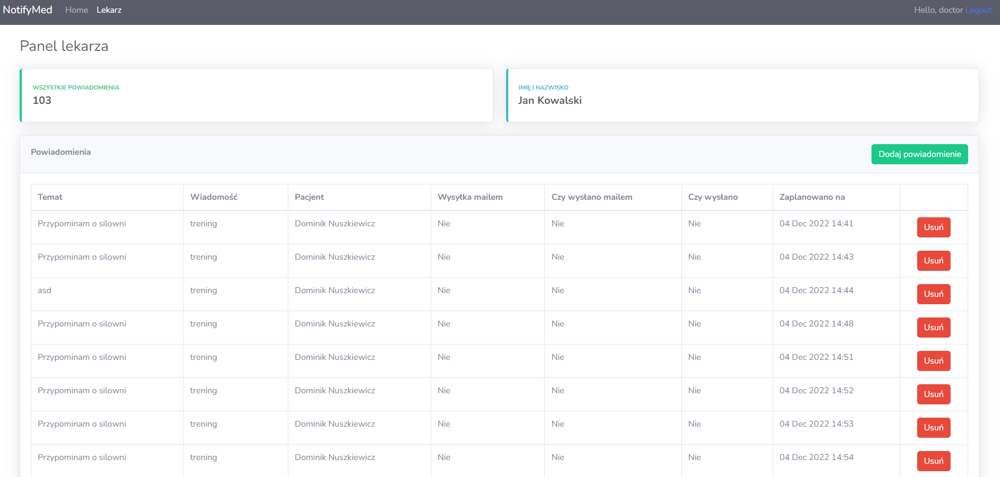

# ismed2022Z_Nuszkiewicz_Pasierbiewicz - measuremed


## 0. Opis projektu, schemat działania i krótka instrukcja
Aplikacja została stworzona w języku Python przy użyciu frameworka Django. 

Dodatkowo użyliśmy bazy danych redis w celu umożliwienia kolejkowania wiadomości do pacjentów. Pomocna była biblioteka django_q, która umożliwiła nam planowanie wywołania się metody odpowiedzialnej za wysłanie powiadomienia o konkretnym czasie. 

Całość systemu postanowiliśmy opakować w kontenery przy użyciu narzędzia Docker i opatrzeć plikiem docker-compose.yml, aby umożliwić uruchamianie systemu z dowolnego miejsca bez instalacji dodatkowych bibliotek, uruchamiania dodatkowych procesów czy instalowania bazy danych.

- Jest to aplikacja webowa umożliwiająca dodawanie powiadomień dla pacjentów przez lekarzy. 

- Powiadomienia są automatycznie wysyłane o wskazanych przez lekarzy godzinach do wskazanych przez lekarzy pacjentów.

- Jest możliwość rejestracji użytkownika jako pacjent lub lekarz. 

- Użytkownik będący w grupie lekarzy ma dostęp do zakładki "Lekarz", w której znajduje się panel do dodawania powiadomień, natomiast pacjent ma dostęp do zakładki "Pacjent", gdzie ma możliwość odczytywania powiadomień i odbierania ich w postaci pojawiającego się pop-upu o konkretnym czasie.


Alert z powiadomieniem, które pojawia się w wyznaczonym przez lekarza czasie



Lekarz może dodawać powiadomienia z poziomu panelu lekarza:


Aby przetestować działanie aplikacji należy ją uruchomić, proces uruchamiania przy użyciu Dockera opisany jest [2. Quick start](#quick-start).

Po uruchomieniu należy wpisać w przeglądarce adres: 
```
http://localhost:8000
```

W celu przeprowadzenia testów należy uruchomić 3 różne przeglądarki (np. google chrome, mozilla firefox, microsoft edge), żeby możliwy był podgląd doktora i dwóch pacjentów w tym samym czasie.

Pozwoli to zobaczyć, że tylko jeden pacjent, wybrany przez lekarza dostaje powiadomienie o godzinie wskazanej przez doktora.

W celu wysłania powiadomienia należy wejść w panel lekarza, nacisnąć przycisk dodaj powiadomienie. Użytkownik będzie miał możliwość wyboru jednego z pacjentów, nadania tematu oraz treści powiadomienia i ustalenia godziny, w której powiadomienie zostanie nadane pacjentowi

O godzinie wysłania powiadomienia przez doktora pacjent otrzyma powiadomienie na samej górze panelu pacjenta.

Podstawowy schemat zależności klas UML(nazewnictwo między przyjętym w kodzie może się różnić, model odwzorowuje zależności):


## 1. Set up a project in development mode

### Python version

We used <b>Python 3.8.10</b> 

### Virtual environment
To install venv with requirements needed in this project:
```
python3 -m venv env
```

Activate a venv(in folder repo/)(venv could)
```
source env/bin/activate
```

Install requirements
```
pip install -r requirements.txt
```

Deactivate while being in a venv. Just type:
```
deactivate
```

Run start.sh script:
```
bash start.sh
```
Then there is need to set up qcluster for djangoq Message Queue and redis, but it can be done with docker-compose automatically in the next step(Quick start)


## 2. Quick start
First of all, install docker on your machine.

https://docs.docker.com/get-docker/

Then, being in this repo root foler ismed2022z_nuszkiewicz_pasierbiewicz/, type
```
docker-compose up --build
```
if this isn't working try to add sudo at the beginning

Open browser and go to
```
http://localhost:8000
```
Now, everything should be up and running.


## 3. For testing purposes we created 2xpatients accounts and 1xdoctor. There are passes:
Patient1:
```
username: patient
password: notifymed123
```

Doctor:
```
username: doctor
password: notifymed123
```


